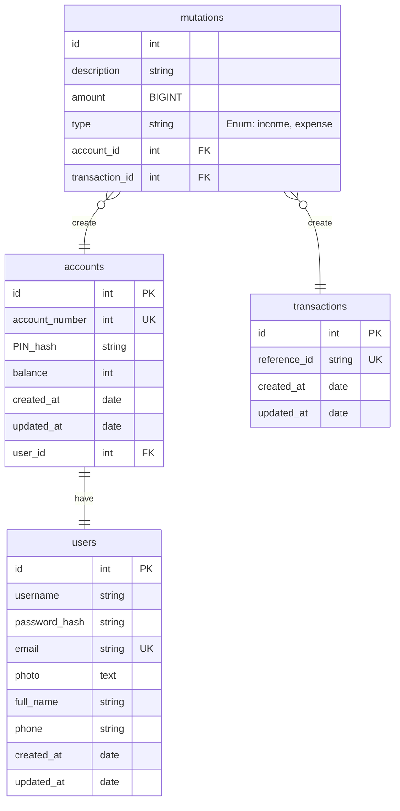

# ERD E-Wallet Seabank

```mermaid


erDiagram


users{
    id int PK
    username string
    password_hash string
    email string UK
    photo text

    full_name string
    phone string
    created_at date
    updated_at date
}

accounts{
    id int PK
    account_number int UK
    PIN_hash string
    balance int

    created_at date
    updated_at date

    user_id int FK
}


transactions{
    id int PK
    reference_id string UK
    created_at date
    updated_at date
}

mutations{
    id int
    description string
    amount BIGINT
    type string "Enum: income, expense"

    account_id int FK
    transaction_id int FK
}


accounts ||--|| users: have
mutations o{--|| transactions: create
mutations o{--|| accounts: create


```
